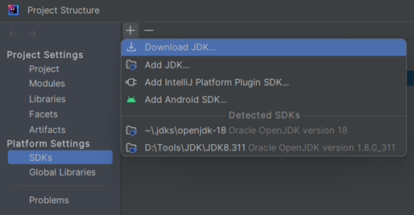
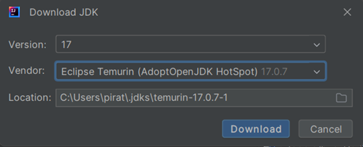
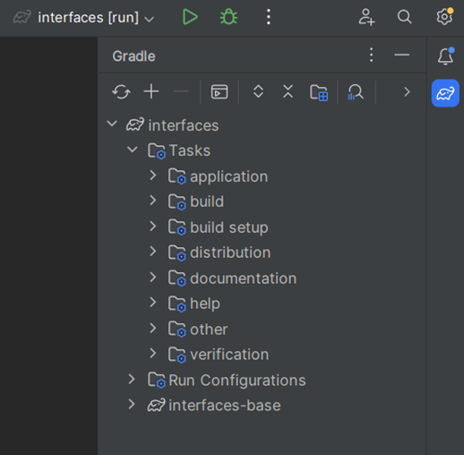
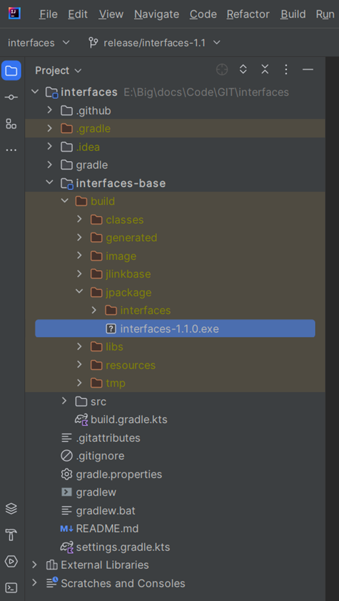
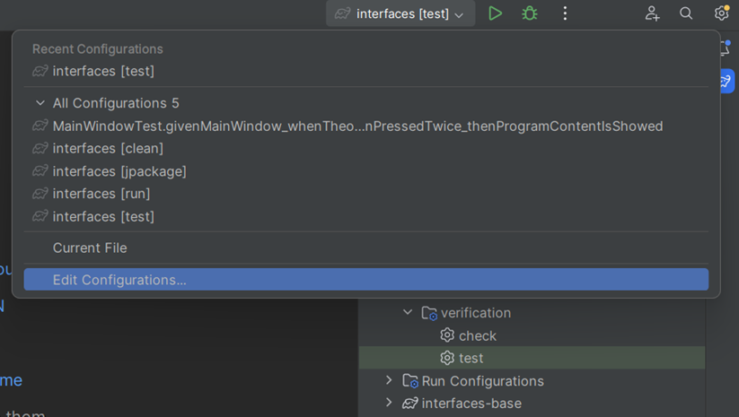
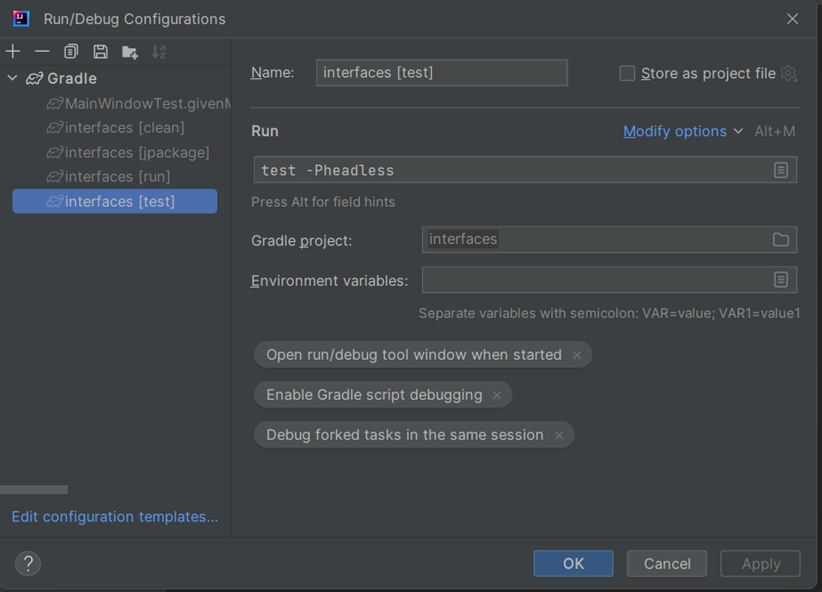
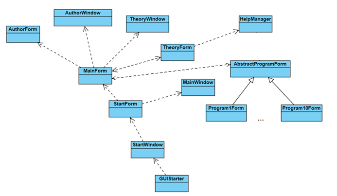

# Руководство разработчика
## Подготовка машины разработчика
Для начала работы необходимо выполнить подготовку машины разработчика.
На текущий момент сборка установщика осуществляется только под ОС Windows,
поэтому вам понадобится:
- клиент Git для управления версиями исходного кода: https://git-scm.com/downloads
- локальный экземпляр сборщика проектов Gradle для автоматического использования Gradle Wrapper при сборке проекта: https://gradle.org/install/
- среда разработки Intellij Idea достаточно бесплатной версии: https://www.jetbrains.com/ru-ru/idea/download/#section=windows
- WiX Toolset (набор инструментов создания инсталляторов под Windows, он необходим для использования библиотекой JPackage): https://wixtoolset.org/docs/v3/releases/v3-14-0-6526/
- доступ в интернет
- учетная запись на https://github.com/

Определите на локальной машине каталог для загрузки исходного кода и в командной
строке из этого каталога выполните команду:

`git clone https://github.com/PirateTigo/interfaces.git`

На данный момент проект имеет следующую модель ветвления Git:

main (основная ветка разработки):
-	release/interfaces-1.0 (ветка релиза 1.0)
-	release/interfaces-1.1 (ветка релиза 1.1)
-	feature/* (ветки разработки конкретных задач проекта)

После завершения клонирования репозитория откройте проект в среде разработки
Intellij Idea. Нажмите сочетание клавиш <Ctrl+Alt+Shift+S> или пункт меню
FileProject Structure… В открывшемся окне откройте раздел управления JDK
в соответствии с рисунком 1.

Рисунок 1 - Выбор JDK

Необходимо указать версию Temurin для набора инструментов разработчика
в соответствии с рисунком 2.

Рисунок 2 - Выбор JDK 17 Temurin

После загрузки средой разработки набора инструментов разработчика необходимо
переключиться в окне на вкладку Project и в поле SDK указать соответствующее
значение. В поле Language level установить версию 11. После этого нажмите кнопку ОК.

## Задачи проекта

Все управление проектом осуществляется с помощью менеджера сборки Gradle из консоли,
либо из соответствующего браузера в среде разработки, который может быть открыт
с помощью пункта меню ViewTool WindowsGradle. Вид окна браузера представлен 
на рисунке 3.

Рисунок 3 - Браузер сборщика проектов Gradle

Проект Gradle управляется с помощью выполнения задач. Для сборки и запуска приложения
из среды разработки нужно выполнить задачу Tasksapplicationrun. Для сборки
инсталлятора используется задача Tasksbuildjpackage. Результат сборки будет
находиться в каталоге interfacesinterfaces-basebuildjpackage согласно рисунку 4.

Рисунок 4 - Результат сборки инсталляционного файла

Для прогона модульных тестов необходимо использовать задачу Tasksverificationtest.
Обратите внимание, что тесты будут запущены в визуальном режиме и корректность их
прогона будет зависеть от текущего разрешения экрана. Для запуска в режиме эмуляции
графической среды стоит запустить тесты с параметром headless. Это можно сделать,
выбрав пункт редактирования исполняемых конфигурации в соответствии с рисунком 5.

Рисунок 5 - Редактирование исполняемых конфигураций

В открывшемся окне выберите конфигурацию для задачи test и добавьте параметр
в соответствии с рисунком 6.

Рисунок 6 - Добавление параметра headless к задаче test

В случае необходимости выполнить только сборку проекта без сборки файла инсталляции,
это можно сделать с помощью задачи Tasksbuildbuild, однако обратите внимание, что
при этом будет автоматически запущена задача прогонов тестов, поэтому если вы хотите
опустить прогон тестов, то это можно сделать, выполнив редактирование исполняемой
конфигурации для задачи build аналогичным образом с командой запуска:

`build -x test`.

## Разработка

Основным языком разработки является язык Java 17, как последняя из версий,
подлежащей долговременной поддержке (LTS). Поскольку в качестве сервера непрерывной
сборки выбрана технология GitHub Actions, имеющая в качестве версии JVM по умолчанию
версию 17 (temurin), локальная сборка и тестирование должны проводиться с 
использованием данной версии Java Development Kit. В качестве системы сборки
программного проекта используется сборщик Gradle.

Предполагается выполнять распространение дистрибутива программы с помощью установщика
программы в среде операционной системы Windows. Программа на Java исполняется под
управлением Java-машины (JVM), поэтому необходимо использование специализированных
средств для адаптации скомпилированных jar-файлов под требования запуска программы
в операционной системе Windows без необходимости установки для этого JVM. Поэтому
в качестве средства для трансформации созданных jar-файлов в исполняемый exe-файл
используется библиотека JLink. А для создания дистрибутива программы с установщиком
библиотека JPackage, соответственно. Подключение всех библиотек, плагинов и настройка
сборки проекта осуществляется в файле interfacesinterfaces-basebuild.gradle.kts.
Данный файл использует синтаксис языка Kotlin.

В качестве библиотеки визуальных компонентов используется библиотека JavaFX.
В частности, её модули javafx.controls, javafx.fxml и javafx.web. Модуль
javafx.controls содержит в себе описания визуальных компонентов. Модуль javafx.fxml
содержит реализацию возможностей декларативного описания формы, содержащей визуальные
компоненты JavaFX с возможностью выполнения разметки в файле с файловым расширением
*.fxml, являющимся расширением формата XML. Модуль javafx.web содержит
java-библиотеки, необходимые для загрузки веб-содержимого, описанного в HTML-файлах.
Последние используются в качестве инструмента для оформления глав справочной
информации в свободном формате.

Проект приложения представляет собой иерархический Gradle-проект, содержащий корневой
модуль interfaces и единственный подмодуль interfaces-base. Такой подход к
организации модулей проекта был выбран по причине возможности дальнейшего развития
приложения, которое может включить дополнительные модули, которые могут иметь
разнообразную направленность. Данный подход позволит гибко вести разработку,
не затрагивая основной модуль interfaces-base.

Для настройки параметров доступа для модуля interfaces-base используется стандартный
для JPMS-системы файл src/main/java/module-info.java, содержащий правила интеграции
текущего модуля в другие модули, а также правила, устанавливающие зависимости
текущего модуля от других модулей.

Основной пакет модуля ru.sibsutis.pmik.hmi.interfaces содержит класс GUIStarter,
содержащий точку входа в JavaFX-приложение. Экземпляр данного класса создается
автоматически при старте Java-приложения и выполняет загрузку всех необходимых для
запуска JavaFX-приложения ресурсов.

Внутренний пакет windows содержит классы, отвечающие за создание окон и форм
приложения. Пакет forms содержит классы-обработчики форм JavaFX. Пакет help содержит
класс HelpManager, использующийся для загрузки html-файлов с описаниями глав
справочной информации. Пакет components содержит класс Autocomplete, являющийся
дочерним классом к стандартному классу TextField библиотеки JavaFX, который (класс
Autocomplete) реализует функциональность поля ввода с выпадающим списком, которая
используется для программы «Поле Чудес» в соответствии с вариантом 7 набора программ
для анализа пользователем.

Помимо программных классов, программный комплекс использует ряд файлов-ресурсов
проекта, которые располагаются в стандартной директории src/main/resources по
соответствующим поддиректориям:
- fonts – содержит файлы описаний используемых шрифтов в формате TTF;
- forms – содержит файлы декларативных описаний форм в формате FXML;
- help – содержит файлы описаний глав справочной информации в формате HTML/CSS/JavaScript, которые загружаются из файла contents.md, имеющим строго определенную структуру и описывающим структуру меню справочной информации;
- icons – содержит набор иконок приложения, которые используются для иконки окон и исполняемых файлов;
- images – содержит набор изображений, используемых для визуального оформления элементов форм программного комплекса.

Диаграмма классов представлена на рисунке 7.

## Расширение проекта
Структура меню раздела справочной информации загружается из файла
interfacesinterfaces-basesrcmainresourceshelpcontents.md. Данный файл
является файлом со строго определенной структурой. Он частично использует синтаксис
Markdown. В рамках этого синтаксиса заголовки первого уровня определяют наименования
элементов справочного меню, располагающихся на первом уровне вложенности. Заголовки
второго уровня являются соответствующими элементами второго уровня вложенности меню.
Эти заголовки являются ссылками на файлы справочной информации, которые описывают в
формате HTML соответствующую главу темы.

Дополнительное условие, которое накладывается на структуру файла contents.md состоит
в том, что последние темы должны иметь название в формате «Вариант N», где N – это
номер варианта программы. Количество загружаемых вариантов регулируется константой
ru.sibsutis.pmik.hmi.interfaces.forms.StartForm.VARIANTS_COUNT.

При необходимости добавить вариант программы нужно выполнить следующие действия:
- изменить значение константы VARIANTS_COUNT;
- подготовить файл декларативного описания формы программы с именем programN.fxml
(N – номер варианта) и разместить его в каталоге
interfacesinterfaces-basesrcmainresourcesformsprograms;
- подготовить класс-обработчик описанной формы, унаследовать его от класса
ru.sibsutis.pmik.hmi.interfaces.forms.programs.AbstractProgramForm и разместить его
в этом же пакете, назвав его ProgramNForm (N – номер варианта).

Обратите внимание, что ветка разработки main защищена от непосредственных изменений
и может принимать изменения только через запросы на изменения (pull requests) из
веток разработки конкретных задач (например ветка feature/INT45). Для управления
процессом разработки на GitHub создан проект:
https://github.com/users/PirateTigo/projects/3. Для выдачи прав администратора к
данному проекту обратитесь, пожалуйста, к текущему разработчику по email:
piratetigo@gmail.com.